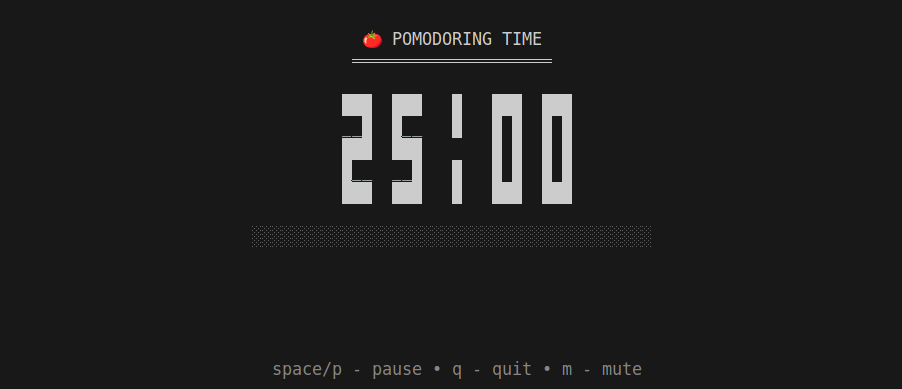

# Pomodoro Timer

<div align="center">
  
</div>

## Overview

The ___Pomodoro Timer___ is a simple ___command-line___ application built in Go that helps users manage their time using the Pomodoro Technique. This technique encourages users to work in focused intervals (typically 25 minutes) followed by short breaks (usually 5 minutes). The application features a customizable timer, sound notifications, and a user-friendly interface.


## Installation

To run the Pomodoro Timer, ensure you have Go installed on your machine. Follow these steps to set up the project:

1. Clone the repository:
   ```bash
   git clone https://github.com/Kontentski/pomodoroGo.git
   cd pomodoroGo
   ```

2. Install the required dependencies:
   ```bash
   go mod tidy
   ```

3. Ensure you have `ffplay` installed for sound notifications. You can install it via:
   - **Ubuntu**: `sudo apt install ffmpeg`
   - **MacOS**: `brew install ffmpeg`
   - **Windows**: Download from [FFmpeg's official site](https://ffmpeg.org/download.html).

## Usage

To start the Pomodoro Timer, run the following command in your terminal:
```bash
go run cmd/pomodoro/main.go
```


### Keyboard Shortcuts

- **Up Arrow / k / K**: Move up in the timer selection menu.
- **Down Arrow / j / J**: Move down in the timer selection menu.
- **Enter**: Select the timer duration.
- **m / M**: Mute or unmute the notification sound.
- **p / Space**: Pause or resume the timer.
- **Esc**: Cancel custom time input.
- **q / Ctrl+C**: Quit the application.

## Contributing

Contributions are welcome! If you have suggestions for improvements or new features, feel free to open an issue or submit a pull request.

## License

This project is licensed under the MIT License. See the [LICENSE](LICENSE) file for details.

## Acknowledgments

- [Bubble Tea](https://github.com/charmbracelet/bubbletea) for the terminal UI framework.
- [Lip Gloss](https://github.com/charmbracelet/lipgloss) for styling terminal output.
- [FFmpeg](https://ffmpeg.org/) for audio playback capabilities.

## Contact

For any inquiries, please reach out to [kontentski@gmail.com](mailto:kontentski@gmail.com).
